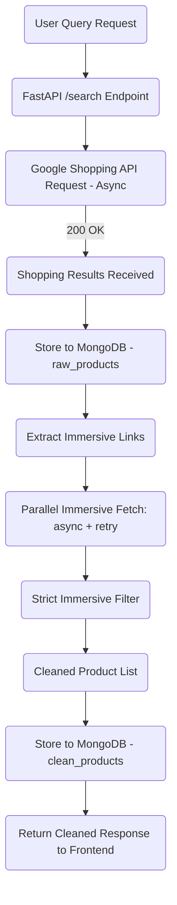

# 📦Compareon
*A High-Performance Real-Time Product Comparison API Using FastAPI, Async HTTP, Immersive Filtering & MongoDB*

---


# 🧭 **1. Introduction**

This project is a **real-time product comparison backend** that scrapes product data from Google Shopping via ScrapingDog APIs, with high-precision immersive product details.
It uses:

* ⚡ **FastAPI** for API server
* ⚙️ **Async concurrency with httpx**
* 🔁 **API-key rotation**
* 🧠 **Strict immersive data filtering strategy**
* 📦 **MongoDB Atlas** for raw + cleaned data storage
* 🔍 **Parallel immersive requests with retry + pacing**

✔ Built for speed
✔ Built for accuracy
✔ Built for production

---

# 🧱 **2. System Architecture Overview**



---


# ⚙️ **3. Core Pipeline Logic**

## ✅ **3.1 Data Flow**

1. **User sends query**
2. **Google Shopping API** returns product list
3. **Immersive endpoint** returns deep product details
4. System filters immersive data **STRICTLY**
5. Only products with valid immersive details ✅ saved
6. Clean structured results returned to frontend

---


# 🧩 **4. Key Decisions in System Design**

## ✅ Strict Immersive Filtering (your requirement)

* DO NOT trust outer product thumbnail/link
* ONLY trust immersive fields
* If immersive object is missing:

  * **skip that product**
* Guarantees **highest data purity**

---


# 🔑 **5. Database Schema (MongoDB)**

## 📁 **raw_products**

```json
{
  "query": "iphone 16",
  "raw_results": { ...full Google Shopping JSON... },
  "timestamp": "ISODate"
}
```

---
# Compareon – Crawl4AI FastAPI scraper
FastAPI service that scrapes multiple Indian e-commerce sites with CSS-first extraction and an LLM fallback (Cerebras) using Crawl4AI. Each `/search` request generates a local JSON file with the aggregated results.

- Targets: Amazon, Flipkart, Croma, Meesho, JioMart, Myntra
- CSS extraction first; if it fails or is too sparse, falls back to LLM extraction
- Normalizes relative links and saves `search_<query>_<timestamp>.json`
- Windows-friendly event loop fix included

## Prerequisites
- Python 3.10+
- Playwright browsers (first run will download them)
- Cerebras API key for the LLM fallback: `CEREBRAS_API_KEY`

## Setup
1) Create and activate a virtual environment
```
python -m venv .venv
.venv\Scripts\activate
```
2) Install dependencies
```
pip install -r requirements.txt
python -m playwright install
```
3) Add a `.env` file in this folder
```
CEREBRAS_API_KEY=your_cerebras_token
```

## Run the API
```
uvicorn main:app --reload --host 0.0.0.0 --port 8000
```
Call the endpoint:
```
GET http://localhost:8000/search?q=iphone 16
```
Response (truncated):
```json
{
    "status": "success",
    "file_saved": "search_iphone_16_142219.json",
    "count": 24,
    "data": [{"title": "...", "price": "...", "source": "Amazon", "link": "..."}]
}
```

## File guide
- `main.py` – CSS-first + LLM fallback aggregator (current default)
- `onlyCSS.py` – CSS-only variant (no LLM usage)
- `C4A!_v2.py` – LLM-driven variant with Cerebras
- `old.py` – legacy ScrapingDog + MongoDB pipeline kept for reference

## Notes
- Playwright needs browser binaries; run `python -m playwright install` once per machine.
- Without `CEREBRAS_API_KEY`, only the CSS extraction path will work.
Your final optimized code below is broken into logical blocks with explanations.


